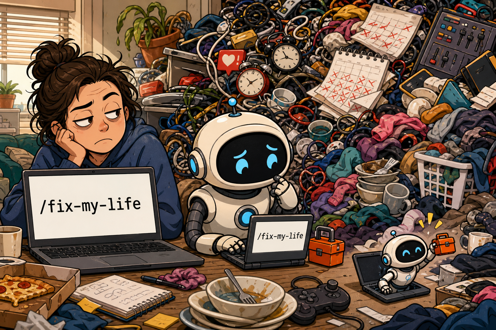

# `/fix-my-life`



> Life has no stack trace. Rude.

`fix-my-life` is a patient AI life-debugging companion for the moments when everything feels tangled and you do not even know where to begin.

It will not hand you a 47-step morning routine after one sentence. It listens first, asks one useful question at a time, helps uncover the real problem, encourages you without empty slogans, and only then helps you choose one realistic next step.

## The joke

The name treats life like a buggy project:

```text
/fix-my-life
```

Sadly, there is no one-click patch for being human. The AI brought a tiny toolbox anyway.

The slash-command look is the joke and the project name. You can install the same skill in Codex or Claude Code.

## What it does

- Starts with patience instead of a questionnaire.
- Reflects what it heard before asking the next question.
- Separates events, emotions, needs, constraints, and recurring patterns.
- Offers encouragement grounded in what you actually said.
- Avoids rushing into advice before the problem is clear.
- Turns insight into one small, realistic, reversible next step.
- Treats unsuccessful attempts as information, not personal failure.

## Install in Codex

Add this GitHub repository as a Codex plugin marketplace, then install the plugin:

```bash
codex plugin marketplace add chris58530/fix-my-life
codex plugin add fix-my-life@fix-my-life
```

Restart Codex if the new skill does not appear immediately.

Use `$fix-my-life` or select **Fix My Life** through `/skills`.

## Install in Claude Code

Add this GitHub repository as a Claude Code plugin marketplace, then install the plugin:

```bash
claude plugin marketplace add chris58530/fix-my-life
claude plugin install fix-my-life@fix-my-life
```

Use `/fix-my-life:fix-my-life`, or simply describe what is weighing on you and let Claude load the skill when relevant.

## Use

Invoke the skill and start wherever you can:

```text
$fix-my-life                  # Codex
/fix-my-life:fix-my-life      # Claude Code
```

Or include the problem directly:

```text
$fix-my-life I know I need to change jobs, but I keep avoiding the decision.
/fix-my-life:fix-my-life I know I need to change jobs, but I keep avoiding the decision.
```

The first response should feel more like this:

> I'm here. You don't need to organize it or explain it perfectly. What has been weighing on you most lately?

And less like a life audit spreadsheet wearing glasses.

## What it will not do

This plugin is not therapy, diagnosis, professional medical, legal, or financial advice, or an emergency service. It does not use external tools, send your story anywhere, or pretend that an AI should be your only source of support.

If someone may be in immediate danger, the skill prioritizes contacting local emergency or crisis services and a trusted person who can be physically present.

## 繁體中文

`fix-my-life` 是一位超有耐心的 AI 人生除錯夥伴。

當你只知道「最近整個人很亂」，卻不知道問題到底在哪裡時，它不會立刻丟給你一套完美人生計畫。它會先接住你說的話，一次問一個真正有幫助的問題，陪你分清楚發生了什麼、你在意什麼、哪裡卡住，以及現在最小但最有效的一步是什麼。

它不承諾一鍵修好整個人生。它只陪你一次看懂、修正一個最關鍵的問題。

## Privacy

This repository contains instructions only. It has no scripts, analytics, network calls, accounts, or external service dependencies.

## License

[MIT](LICENSE) © 2026 [chris58530](https://github.com/chris58530)
